# SMSUp SDK
https://smsup.ch/ is a swiss platform to send professional SMS with a free registration and without subscription.
This platform can be called through web REST APIs.
The full documentation is available here: https://doc.smsup.ch/en/api/sms/getting-started
This SDK proposes an easy way to call the APIs of SMSUp

## SDK Coverage over SMSUp functionalities


## Using SDK

For instance, to send an Alert SMS to some recipient 

```java
import io.nagurea.smsupsdk.sendsms.singlemessage.SingleMessageService;

public class SingleMessageMain {
    public static void main() {
        //initiate the service with root url
        final SingleMessageService singleMessageService = new SingleMessageService("https://api.smsup.ch/");
        
        //call service action. Here send a SMS (alert type) with token, text to send, recipient number
        singleMessageService.sendAlert("My token", "This is my text", "41762565862");
    }
}
```

## Modifying the documentation
To modify the documentation you may need to modify the diagrams.
The diagrams are created thanks to mermaid (https://mermaid-js.github.io/) which is a Javascript based diagramming and charting tool that uses Markdown-inspired text definitions and a renderer to create and modify complex diagrams. The main purpose of Mermaid is to help documentation catch up with development according to their own description.
The choice has been made to use the mermaid CLI (https://github.com/mermaid-js/mermaid-cli) to generate the diagrams.
For instance, to generate the functional coverage : `mmdc -i functionnal-coverage.mmd -o functionnal-coverage.svg`
